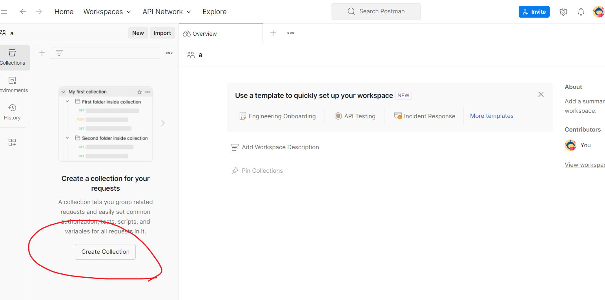
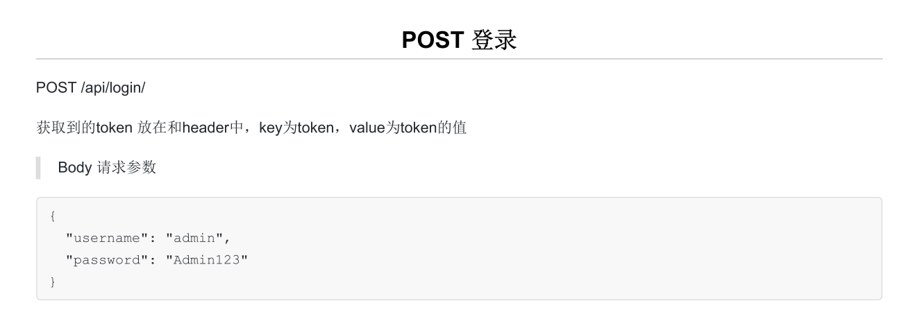

## 对外开放的上传图片的接口： 
```bash
POST http://localhost:8000/message/sendwarn
{
    "subject": "1", //1表示distance，2表示danger，3表示fatigue，4表示face,选择的是哪个，下面对应的必须给出url
    "terminal_number": "1212",  //终端编号
    "distance":"https://img0.baidu.com/it/u=2631815445,1952611015&fm=253&fmt=auto&app=120&f=JPEG?w=1280&h=800",
    "danger": "存放危险驾驶行为报警图片url",
    "fatigue": "疲劳驾驶报警图片",
    "face": "驾驶员身份不匹配图片"
}
```


### 部署方法

sudo yum groupinstall -y "Development Tools"
sudo yum install -y openssl-devel bzip2-devel libffi-devel
cd /opt
sudo wget https://www.python.org/ftp/python/3.7.6/Python-3.7.6.tgz
sudo tar xzf Python-3.7.6.tgz
cd Python-3.7.6
sudo ./configure --enable-optimizations
python3.7 -V
python3.7 -m ensurepip --upgrade
cd myproject
unzip OPMS_v3-dev3.1.zip
cd OPMS_v3-dev3.1
pip3 install -r myrequirements.txt
python3.7 manage.py runserver 0.0.0.0:8000
nohup python3.7 manage.py runserver 0.0.0.0:8000 &


#### 启动方式

```bash
cd /opt/opms_website/opms  //切换目录到requirements.txt，不一定是这个命令
pip3 install -r myrequirements.txt -i https://pypi.tuna.tsinghua.edu.cn/simple   //这个必须做
```


#### 同步数据库

```bash
python manage.py makemigrations
python manage.py migrate
```
然后右上角配置一下django server就可以了


有问题就点击 ”fix“配置一下setting.py的位置


# 上面做完了就可以启动，下面讲下接口怎么调用
打开这个软件： 
然后创建connection：
再点击add request 
然后就是调用接口的地方： 

上面是postman的配置，现在已经配置完毕。
下面看接口文档

要求我们调用这个请求，所以我们在postman中输入 
http://localhost:8000/api/login 
{
    "username": "adminyhm",
    "password": "adminmm"
}

点击右边的 “send”，就会请求，得到响应（前提服务器已启动）

上面的响应和接口文档要求一致： 


然后来看第二个接口：

我们在postman输入,这就是上传图片的地方
http://localhost:8000/api/send_event_data
{
	"data": {
		"location": {
			"longitude": "107.84624",
			"Latitude": "29.82600"
		},
		"road": "G50沪渝高速",
		"picture_url": "picture/2021-2/12345.jpg",
		"picture_base64": "",
		"detail_type": "抽烟",
		"remarks": "抽烟影响安全驾驶",
		"create_time": "2021-02-01 11:31 : 02",
		"data_type": "1003"
	}
}
// 这里的picture_base64 不应该是空，应该是一张图片的base64编码
获得方法是去 https://tool.chinaz.com/tools/imgtobase

上传图片 

然后你把 base64, 后面的所有字符串复制到picture_base64后面的引号里面


然后请求就会上传警告的图片了。然后 1003是distance，1004是danger，1005是fatigue，1006是face

对于接口文档的第三个接口，在postman填写：
http://localhost:8000/api/upload_file
{
    "file": ""
}
这里file值还是base64，获取方法和前面一致。
请求后会得到：


#### 创建超级用户，根据提示创建

```bash
python manage.py createsuperuser
```


#### 安装环境

```bash
pip3 install uwsgi
```


#### 创建文件，添加配置：/etc/uwsgi.ini，应该可以不做

```bash
[uwsgi]
//运行端口号
socket = 127.0.0.1:9090
//主进程
master = true
//多站模式
vhost = true
//多站模式时不设置入口模块和文件
no-stie = true
//子进程数
workers = 2
reload-mercy = 10
//退出、重启时清理文件 
vacuum = true
max-requests = 1000   
limit-as = 512
buffer-sizi = 30000
//pid文件，用于下面的脚本启动、停止该进程
pidfile = /var/run/uwsgi.pid
daemonize = /var/log/uwsgi.log
```


#### 创建启动脚本:/etc/init.d/uwsgi

```bash
#!/bin/bash

NAME='uwsgi'
DAEMON='uwsgi'
CONFIGFILE="/etc/$NAME.ini"
PIDFILE="/var/run/$NAME.pid"
SCRIPTNAME="/etc/init.d/$NAME"
   
do_start() {
$DAEMON $CONFIGFILE || echo -n "uwsgi  running" 
}

do_stop() {
    $DAEMON --stop $PIDFILE || echo -n "uwsgi not running"
    rm -f $PIDFILE
    echo "$DAEMON STOPED."
}

do_reload() {
    $DAEMON --reload $PIDFILE || echo -n "uwsgi can't reload"
}

do_status() {
    ps aux|grep $DAEMON
}

case "$1" in
status)
    echo -en "Status $NAME: \n"
    do_status
;;
start)
    echo -en "Starting $NAME: \n"
    do_start
;;
stop)
    echo -en "Stopping $NAME: \n"
    do_stop
;; 
reload|graceful)
    echo -en "Reloading $NAME: \n"
    do_reload
;;
*)
    echo "Usage: $SCRIPTNAME {start|stop|reload}" >&2
    exit 3
;;
esac
exit 0
```


#### 创建 nginx 虚拟主机

```bash
server {
    # 设置网站运行端口
    listen       10000;
    server_name  localhost;
   
    location / {
        include  uwsgi_params;
        # 必须和uwsgi中的设置一致
        uwsgi_pass  127.0.0.1:9090;
        # 入口文件，即wsgi.py相对于项目根目录的位置，“.”相当于一   层目录
        uwsgi_param UWSGI_SCRIPT opms.wsgi;
        # 项目根目录
        uwsgi_param UWSGI_CHDIR /opt/opms_website/opms;
        index  index.html index.htm;
        client_max_body_size 35m;
    }
    # 静态文件目录
    location /static/ {
        alias  /opt/opms_website/opms/static/;
        index  index.html index.htm;
    }
}
```


#### 启动服务

```bash
/etc/init.d/uwsgi start
```


#### 启动 nginx


#### 启动 main.py

```bash
python /opt/opms_website/opms/extra_apps/webssh/main.py & >/dev/null
```

#### 用之前创建的用户登录后台
```bash
http://xxxx:10000/admin
```

#### 初始化

* 找到公司表，添加公司
* 然后部门表添加部门
* 然后职位表，添加职位
* 最后找到用户表，完善当前用户的一些用户信息

#### 初始化平台
找到平台表，添加你们公司用到的一些平台，如 zabbix，jenkins 等，logo 路径为 opms/media/platform-management/logo 下面
添加时候，如 zabbix logo 只需要写 platform-management/logo/zabbix.png 即可


#### 服务正常使用
http://xxxx:10000


